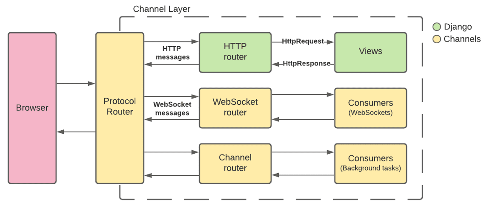

# 对话后端

## Django 框架

### scope 和 event
Channels 和 ASGI 将传入连接分为两个组件：scope 和 一系列 events。

Scope 是关于单个传入连接的一组详细信息 - 例如发出 Web 请求的路径，或 WebSocket 的原始 IP 地址，或用户向聊天机器人发送消息 - 并在整个连接中持续存在。

在 Scope 生命周期内，会发生一系列时间。

Channels 或 ASGI 应用将在 **每个 scope 范围内实例化一次，然后接收该 scope 内发生的事件流**以决定如何处理。

### Consumer
Consumer 是 Channels 代码的基础单元。当出现一个请求或者新的套接字，Channels 会遵循它的路由表，为该传入连接找到正确的 Consumer，并启动它的副本。

## html 部分内容

Websocket 是一种**网络通信协议**。

### 为什么需要 Websocket?
因为 HTTP 协议规定，通信只能由客户端发起。如果服务器有连续的状态变化，客户端想要获知就只能使用“轮询”。

轮询效率低，非常浪费资源。

WebSocket 支持服务器主动向客户端推送消息，客户端也可主动向服务器发送消息

其特点有：
1. 建立在 TCP 协议之上，服务器端的实现比较容易.
2. 与 HTTP 协议有着良好的兼容性。默认端口也是80和443，并且握手阶段采用 HTTP 协议，因此握手时不容易屏蔽，能通过各种 HTTP 代理服务器。
3. 数据格式比较轻量，性能开销小，通信高效；可以放松文本，也可以发送二进制数据。
4. 没有同源限制，客户端可以与任意服务器通信。
5. 协议标识符是 `ws`（如果加密，则为`wss`），服务器网址是 URL。

### 如何使用 Websocket?

#### WebSocket 客户端 API
WebSocket 对象作为一个构造函数，用于新建 WebSocket 实例
`var ws = new WebSocket('ws://localhost:8080')`
执行之后，客户端就会与服务器端进行连接。

|实例对象属性|用途|
|----|----|
|ws.onopen|指定连接成功后的回调函数|
|ws.onmessage|用于指定收到服务器数据后的回调函数|
|ws.onclose|用于指定连接关闭后的回调函数|

`ws.send()` 方法用于向服务器发送数据。

#### Django 实现

**Django Channels**

Django Channels 扩展了 Django 的内置功能，允许 Django 项目不仅可以处理 HTTP，还可以处理需要长时间运行连接的协议，例如 WebSockets、MQTT (IoT)、聊天机器人、收音机和其他实时连接。
基本的 Channels 设置如下所示：

**Django asgiref**
有 Channels 和 Django 之间的差异，我们必须经常在同步和异步代码执行之间切换。例如，Django 数据库需要使用同步代码访问，而 Channels 通道层需要使用异步代码访问。

在两者之间切换的最简单方法是使用内置的 Django asgiref ( `asgrief.sync`) 函数：

1. `sync_to_async`- 接受一个同步函数并返回一个包装它的异步函数
2. `async_to_sync`- 接受一个异步函数并返回一个同步函数

## 数据库

### Redis
Redis (Remote Dictionary Server) 远程字典服务，是一个开源的使用ANSI C语言编写、支持网络、可基于内存亦可持久化的日志型、Key-Value数据库。
由于是内存数据库，读写非常高速，可达10w/s的频率，所以一般应用于数据变化快、实时通讯、缓存等。

相比于其他的 key-value 缓存产品有以下三个特点：

Redis 支持数据的持久化，可以将内存中的数据保存在磁盘中，重启的时候可以再次加载到内存使用。

Redis 不仅支持简单的 key-value 类型的数据，同时还提供 list，set，zset，hash 等数据结构的存储。

Redis 支持主从复制，即 master-slave 模式的数据备份。

## 前后端连接

## 参考内容链接

[WebSocket 教程](https://www.ruanyifeng.com/blog/2017/05/websocket.html)
[Introduction to Django Channels](https://testdriven.io/blog/django-channels/)